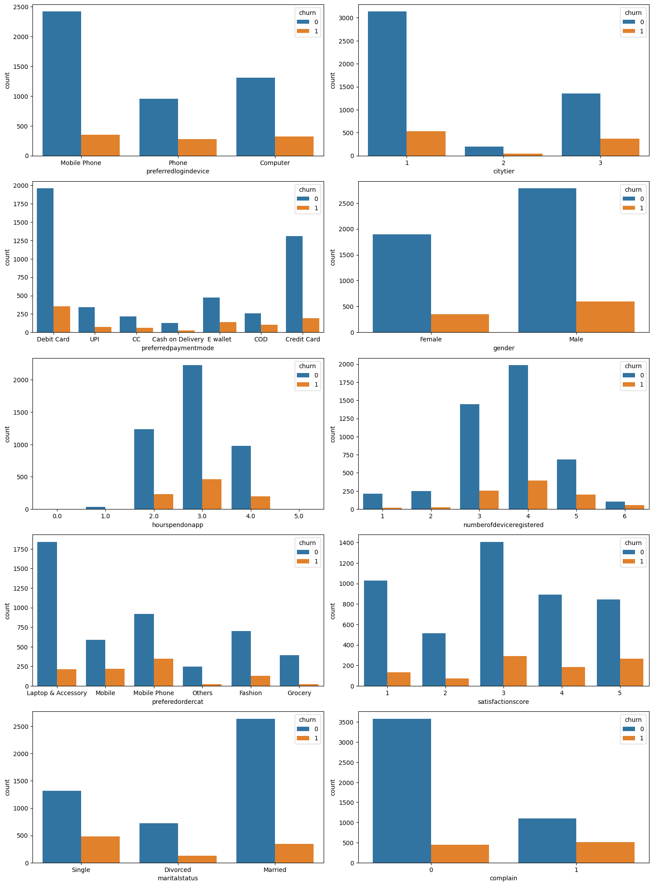
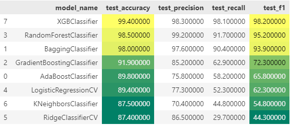
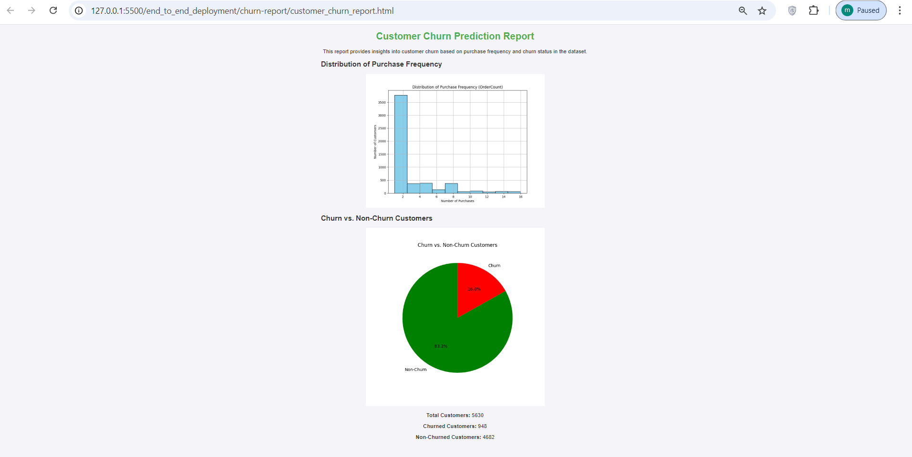

# Customer Churn Prediction Application

## Customer churn prediction overview

Customer churn prediction predicts the likelihood of customers canceling a company’s
products or services. In most cases, businesses with repeat clients or clients under
subscriptions strive to maintain the customer base. Therefore, it is important to keep track of
the customers who cancel their subscription plan and those who continue with the service.
This approach requires the organization to know and understand their client’s behavior and
the attributes that lead to the risk of the client leaving. I will explain the steps necessary in
creating and deploying a churn prediction machine-learning model.

## Why Predict Customer Churn?

It is important for any organization dealing with repeat clients to find ways to retain existing
ones. The approach is crucial since customer churn is expensive, and acquiring new clients is
more expensive than retaining existing ones. Consider an internet service (ISP) provider who
has acquired a new user. They will need technicians and hardware to connect the latest client
to their service. The client will only be required to pay the subscription fee to continue using
their plan. If the user fails to renew their service, the company will most likely be at a loss,
especially if the trend continues for several customers. The monthly recurring revenue (MRR)
for such an institution will likely be low; hence, it will be unable to sustain the business. Thus, a
reliable churn prediction model should help companies stay afloat as they scale up and attract
more customers.

## Case Study of Customer Churn Prediction Model

Creating churn prediction models involves using historical customer data to predict the
likelihood of the current customer leaving or continuing with a particular service/product. The
data used for the predictive models include product usage data and direct customer feedback.
Besides, the predictive models identify the different trends and patterns in the data to forecast
customer churn.

**Scenario**

Consider an e-commerce company with historical data on how its clients have interacted with
its services. The company wants to know the likelihood of customers churning so it can launch
targeted marketing campaigns.

**Data source and GitHub repo**

[Dataset source](https://www.kaggle.com/datasets/ankitverma2010/ecommerce-customer-churn-analysis-and-prediction/data)

**About the dataset**

The data is in .xlsx format with the following features:

| Feature Name                | Description                                                                                     |
| --------------------------- | ----------------------------------------------------------------------------------------------- |
| CustomerID                  | Unique customer ID                                                                              |
| Churn                       | Flag indicating whether the customer churned (1) or not (0)                                     |
| Tenure                      | Tenure of the customer in the organization                                                      |
| PreferredLoginDevice        | The preferred device used by the customer to log in (e.g., mobile, web)                         |
| CityTier                    | City tier classification (e.g., Tier 1, Tier 2, Tier 3)                                         |
| WarehouseToHome             | Distance between the warehouse and the customer’s home                                          |
| PreferredPaymentMode        | Preferred payment method used by the customer (e.g., credit card, debit card, cash on delivery) |
| Gender                      | The gender of the customer                                                                      |
| HourSpendOnApp              | Number of hours spent on the mobile application or website                                      |
| NumberOfDeviceRegistered    | Total number of devices registered to the customer’s account                                    |
| PreferedOrderCat            | Preferred order category of the customer in the last month                                      |
| SatisfactionScore           | Customer’s satisfaction score with the service                                                  |
| MaritalStatus               | Marital status of the customer                                                                  |
| NumberOfAddress             | Total number of addresses added to the customer’s account                                       |
| OrderAmountHikeFromlastYear | Percentage increase in order value compared to last year                                        |
| CouponUsed                  | Total number of coupons used by the customer in the last month                                  |
| OrderCount                  | Total number of orders placed by the customer in the last month                                 |
| DaySinceLastOrder           | Number of days since the customer’s last order                                                  |
| CashbackAmount              | Average cashback received by the customer in the last month                                     |

The dataset had no duplicate rows. Dropping the CustomerID column, which is each
customer's unique identifier, has no effect on predicting churn.

**EDA and Plots**

Visualizing the categorical columns indicates:

1. About 83.2 % of the customers were retained,while 16.8% churned.
2. The company also has more male than female clients.
3. Most clients prefer logging in from their mobile phones to their phones and computers.
4. Most clients spend an average of 2 and 4 hours on the company’s app.
5. Most customers have about 3 or 4 devices registered for the retailer’s app.
6. Most customers prefer debit and credit cards to make payments.
7. City tier 2 has the lowest number of customers.

From the figure, notice that many customers placed their first and second orders, and the
number reduced in subsequent orders. Additionally, the number of customers reduced a week
after their last order.


**Churn Distribution**



## Choosing the Right Machine Learning Model

You need to build a machine-learning model to predict customer churn. Therefore, you must
choose the appropriate classification model since the target class (churn) consists of a discrete
class of features (Yes and No). The classification model is suitable because it is a supervised
model that uses historical data to find patterns in customer churn behavior. However, you
should use regression models if the data has continuous values on the target class.

## Data Preprocessing

To build a machine learning model with high accuracy, one needs to preprocess the data to
reduce its complexity. Since the data had missing values, there is a need to impute these
values appropriately.

```
from sklearn.impute import SimpleImputer # Imports SimpleImputer for
handling missing data with basic strategies.
from sklearn.experimental import enable_iterative_imputer # Enables the
experimental IterativeImputer in scikit-learn.
from sklearn.impute import IterativeImputer # Imports IterativeImputer
for advanced imputation techniques using iterative models.
from sklearn.ensemble import RandomForestRegressor # Imports
RandomForestRegressor for regression tasks using ensemble methods.
import pandas as pd # Imports the pandas library for data manipulation
and analysis.
```

```
def fill_missing_values(df, random_state=None):
# Step 1: Identify numeric and categorical columns
numeric_columns = df.select_dtypes(include=['float64',
'int64']).columns.tolist()
categorical_columns = df.select_dtypes(include=
['object']).columns.tolist() # Include both string and category data
```

```
# Step 2: Impute numeric columns
numeric_imputer = SimpleImputer(strategy='mean')
df[numeric_columns] = numeric_imputer.fit_transform(df[numeric_columns])
```

```
# Step 3: Handle categorical columns
for col in categorical_columns:
if df[col].dtype == 'object':
# Convert categorical column to one-hot encoded representation
```

```
encoded_cols = pd.get_dummies(df[col], prefix=col)
# Concatenate one-hot encoded columns
df = pd.concat([df.drop(col, axis=1), encoded_cols], axis=1)
```

```
# Step 4: Random Forest Iterative Imputer for the entire DataFrame
rf_imputer =
IterativeImputer(estimator=RandomForestRegressor(random_state=random_sta
te))
df = pd.DataFrame(rf_imputer.fit_transform(df), columns=df.columns)
```

```
return df
```

```
# Call the function to fill missing values
df = fill_missing_values(df, random_state=42)
```

The data had mixed data types, so the Random Forest Iterative Imputer was appropriate for
filling in the missing values due to its high accuracy. The first imputation step involved
identifying the dataset’s numeric and categorical columns to impute separately. After that, the
missing values in the numerical columns were imputed using the mean. The categorical
columns were converted to a one-hot encoded representation and then concatenated. The
final step involved initiating the Random Forest Iterative Imputer for the entire data frame.

**Splitting Data to Training and Testing Dataset**

```
# Split model into training and test set
X = df.drop(columns=["churn"])
y = df["churn"]
```

```
X_train, X_test, y_train, y_test = train_test_split(X, y, test_size=0.2,
random_state=0)
```

This step ensures there are different datasets for training and testing the machine learning
models.

**Oversampling using SMOTE**

Since the target variable ‘Churn’ was highly imbalanced, balancing this target feature on the
training dataset is important. The Synthetic Minority Over-sampling Technique (SMOTE) is the

appropriate method to generate synthetic samples of the minority class to balance the target
variable and improve model performance during model training.

```
from imblearn.over_sampling import SMOTE
```

```
print('Before upsampling count of label 0 {}'.format(sum(y_train==0)))
print('Before upsampling count of label 1 {}'.format(sum(y_train==1)))
# Minority Over Sampling Technique
sm = SMOTE(sampling_strategy = 1, random_state=1)
X_train_s, y_train_s = sm.fit_resample(X_train, y_train.ravel())
print('After upsampling count of label 0 {}'.format(sum(y_train_s==0)))
print('After upsampling count of label 1 {}'.format(sum(y_train_s==1)))
```

## Models Evaluation

The different classification models included the following, ranked from the highest to the least
performing.



The information shows that the XGBoost classifier was the best performer with high test
accuracy and f1 score. Therefore, the final customer churn prediction model would be built
based on the XGBoost classifier.

Below is a visualization of the feature weights, which indicate the importance of each feature
in predicting customer churn.


Therefore, the features that will be used for the final deployment model are:

1.Tenure

2. Cashback amount

3. City tier

4. Warehouse to home

5. Order amount hike from last year

6. Days since last order

7. Satisfaction score

8. Number of addresses

9. Number of devices registered

10. Complain

11. Order count

12. hourspendonapp

13. Marital status

14. Coupon used

15. Gender

Drop the unwanted columns from the training and testing dataset in this scenario.

Since the final deployment model is the XGBoost classifier, convert the Pandas data frame to a
NumPy array. The conversion helps load and predict values in the Flask app without
encountering an error.

```
# Convert the Pandas datafram to NumPy array for the XGBoost classifier.
# The conversion helps in loading and predicting values in the flask
app.
```

```
X_test = X_test.values
X_train = X_train.values
```

```
# Run the model
final_model=XGBClassifier()
final_model.fit(X_train, y_train)
train_pred = final_model.predict(X_train)
test_pred = final_model.predict(X_test)
```

```
final_model.score(X_test, y_test)
```

## Saving the Model

Now save the model as a pickle file. Also, save the data columns as a JSON file.

```
import pickle
pickle.dump(final_model,open('end_to_end_deployment/models/churn_predict
ion_model.pkl','wb'))
```

```
#save the data columns
import json
```

```
columns = {'data_columns' : [col.lower() for col in X.columns]}
```

```
with open("end_to_end_deployment/models/columns.json","w") as f:
f.write(json.dumps(columns))
```

## Application Building

#### **Application Input Interface**

**Input Interface:** Allows users to input customer data for prediction.


#### **Application Results Interface**

**Results Interface:** Displays the prediction results.


#### **Generate an HTML report that contains visualizations and performance metrics**



## Conclusion

This project demonstrates a workflow for building a customer churn prediction model using machine learning techniques. By analyzing customer behavior data, we can predict which customers are likely to churn, allowing businesses to intervene with retention strategies.

The insights provided by this project can help e-commerce businesses reduce churn rates and improve customer retention, leading to increased revenue and customer satisfaction.

---

## Future Work

To further enhance this project, the following improvements can be made:

- **Feature Engineering**: Adding more features like customer interaction history, product preferences, and engagement on social media.
- **Model Tuning**: Fine-tuning model hyperparameters for better accuracy.
- **Real-time Prediction**: Deploying the model for real-time churn prediction using live customer data.
  """

Create the customer churn prediction app using Flask. The input and output interfaces are
shown below.

Given the available customer data, the company can now use customer details to determine
whether they would churn. This approach would help the organization determine how to
engage with the customers and launch targeted campaigns for customer retention.

# References

- _Allan Ouko_ Blog on medium. [Link](https://medium.com/@allanouko17/customer-churn-prediction-using-machine-learning-ddf4cd7c9fd4)
